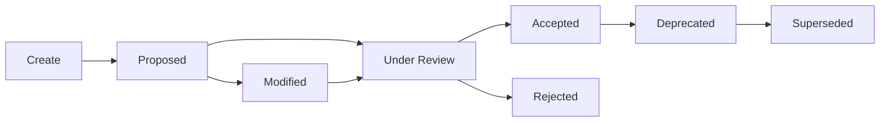

# ADR Workflows

Best practices and workflows for managing Architecture Decision Records (ADRs) throughout their lifecycle using Folio's advanced ADR management features.

## ADR Lifecycle Overview



## Creating ADRs

### Standard ADR Creation

```bash
# Create new ADR with descriptive title
folio new adr "Use PostgreSQL for primary database"

# Creates: 0001-use-postgresql-for-primary-database.md
```

### ADR with Context

```bash
# Link to related epic or initiative
folio new adr "Adopt microservices architecture" --epic="ARCH-2024"

# ADR for specific component
folio new adr "Choose message queue for user notifications" --owner="platform-team"
```

### Template Customization

Customize your ADR template (`templates/adr.md`) to include your standard sections:

```markdown
---
id: {{id}}
title: "{{title}}"
status: proposed
date: {{date}}
authors: []
tags: []
---

# {{title}}

## Status

{{status}} - {{date}}

## Context

What is the issue that we're seeing that is motivating this decision or change?

## Decision

What is the change that we're proposing or have agreed to implement?

## Consequences

What becomes easier or more difficult to do and any risks introduced by this change?

## Alternatives Considered

What other options did we look at?

## References

- Links to relevant discussions, issues, or documents
```

## Review and Decision Process

### 1. Proposal Phase

When ADRs are created, they start as "proposed":

```bash
# List all proposed ADRs for review
folio adr list --status="proposed"

# Find ADRs that need attention
folio find "TODO" --type=content
folio find "FIXME" --type=content
```

### 2. Review Process

```bash
# During architecture review meeting
folio adr list --status="proposed" --format=list

# Review specific ADR
folio find "0003"  # Or specific ID

# Update status after decision
folio status adr 3 "accepted"
```

### 3. Batch Status Updates

For handling multiple ADRs:

```bash
# List pending decisions
folio adr list --status="proposed"

# Accept multiple ADRs (manual process)
folio status adr 1 "accepted"
folio status adr 2 "accepted"  
folio status adr 4 "rejected"
```

## Status Management

### Status Transitions

Folio supports standard ADR status workflows:

```typescript
// folio.config.ts
status: { 
  type: 'string', 
  enum: ['proposed', 'accepted', 'rejected', 'deprecated'],
  default: 'proposed'
}
```

### Common Status Updates

```bash
# Accept an ADR
folio status adr 5 "accepted"

# Reject with documentation
folio status adr 6 "rejected"
# (Add rejection reason in the document manually)

# Deprecate when superseded
folio adr deprecate 2 --superseded-by="0007" --reason="Replaced by updated approach"
```

## ADR Deprecation Workflows

### Simple Deprecation

```bash
# Mark ADR as deprecated
folio adr deprecate 3

# With reason
folio adr deprecate 3 --reason="No longer relevant due to technology change"
```

### Supersession Workflow

```bash
# Create replacement ADR
folio new adr "Updated database strategy using PostgreSQL and Redis"

# Deprecate old ADR with reference
folio adr deprecate 3 --superseded-by="0008" --reason="Superseded by comprehensive database strategy"
```

### Preview Changes

```bash
# Always preview deprecation changes first
folio adr deprecate 3 --dry-run --reason="Technology changed"
```

## Renumbering and Cleanup

### When to Renumber

Consider renumbering ADRs when:
- You have gaps in numbering (deleted ADRs)
- Numbers have grown very large
- Starting fresh after major refactoring
- Importing ADRs from another system

### Safe Renumbering Process

```bash
# 1. Preview the renumbering
folio adr renumber --dry-run

# 2. Backup your repository
git add . && git commit -m "Backup before ADR renumbering"

# 3. Execute renumbering
folio adr renumber --force

# 4. Update any external references manually
```

### Post-Renumbering Tasks

After renumbering:

1. **Update external references**: Check documentation, issues, and code comments
2. **Inform team**: Notify team members about ID changes
3. **Update bookmarks**: Browser bookmarks and shortcuts
4. **Regenerate navigation**: `folio generate-nav`

## Integration with Development Workflow

### Branch-Based ADR Workflow

```bash
# Create feature branch for ADR
git checkout -b adr/database-choice

# Create and iterate on ADR
folio new adr "Choose between PostgreSQL and MongoDB"
# Edit the ADR with research and analysis

# Commit ADR
git add docs/02-architecture-and-design/adrs/
git commit -m "Add ADR: Choose between PostgreSQL and MongoDB"

# Push for review
git push origin adr/database-choice
```

### PR Review Process

In pull request reviews:

1. **Review ADR content**: Ensure completeness and clarity
2. **Validate metadata**: Check status, tags, and relationships
3. **Check navigation**: Ensure `folio generate-nav` was run
4. **Validate format**: Run `folio validate` in CI

### Merge and Decision

```bash
# After PR approval and merge
git checkout main
git pull origin main

# Update status if decision was made
folio status adr 9 "accepted"

# Regenerate navigation
folio generate-nav

# Commit status update
git add docs/ && git commit -m "Accept ADR: Database choice"
```

## Advanced ADR Management

### Tagging and Categorization

Use frontmatter for rich categorization:

```yaml
---
id: 10
title: "Implement caching strategy"
status: accepted
tags: ["performance", "caching", "redis", "architecture"]
components: ["api", "database", "frontend"]
impact: "high"
effort: "medium"
---
```

### Search and Analysis

```bash
# Find ADRs by topic
folio find "performance" --type=content
folio find "security" --type=any

# Analyze decision patterns
folio adr list --status="accepted" | grep -i "database"
folio adr list --status="rejected" | wc -l
```

### Metrics and Reporting

Track ADR metrics:

```bash
# Decision velocity
folio adr list --status="proposed" --format=json | jq '.total'
folio adr list --status="accepted" --format=json | jq '.total'

# Age of pending decisions
folio adr list --status="proposed" --format=list

# Technology trend analysis
folio find "microservices" --type=content
folio find "kubernetes" --type=content
```

## ADR Quality Guidelines

### Content Standards

Ensure ADRs include:

1. **Clear context**: Why this decision is needed
2. **Explicit decision**: What exactly is being decided
3. **Consequences**: Positive and negative impacts
4. **Alternatives**: Other options considered
5. **References**: Supporting documentation

### Metadata Standards

Consistent frontmatter:

```yaml
---
id: 15
title: "Adopt Event Sourcing for audit trail"
status: proposed
date: 2024-07-08
authors: ["system-architect", "senior-dev"]
reviewers: ["tech-lead", "product-owner"]
tags: ["event-sourcing", "audit", "compliance"]
components: ["backend", "database"]
impact: "high"
effort: "high"
deadline: "2024-08-01"
---
```

### Review Checklist

Before accepting ADRs:

- [ ] Decision clearly stated
- [ ] Context adequately explained  
- [ ] Consequences analyzed
- [ ] Alternatives documented
- [ ] Implementation plan included
- [ ] Success criteria defined
- [ ] Risk mitigation addressed

## Automation and Integration

### Automated ADR Workflows

Set up automated workflows:

```yaml
# .github/workflows/adr-management.yml
name: ADR Management
on:
  schedule:
    - cron: '0 9 * * 1'  # Weekly reminder

jobs:
  adr-review:
    runs-on: ubuntu-latest
    steps:
      - uses: actions/checkout@v3
      - uses: actions/setup-node@v3
        with:
          node-version: '18'
      - run: npm ci
      
      # Check for stale proposed ADRs
      - name: Check stale ADRs
        run: |
          STALE=$(folio adr list --status=proposed --format=json | \
            jq '.documents[] | select(.date < (now - 30*24*3600 | strftime("%Y-%m-%d")))')
          if [ -n "$STALE" ]; then
            echo "Stale proposed ADRs found - please review"
          fi
```

### Integration with Issue Tracking

Link ADRs to issues:

```yaml
---
id: 20
title: "Choose CI/CD platform"
status: proposed
related_issues: ["PROJ-123", "PROJ-456"]
epic: "EPIC-001"
---
```

## See Also

- [folio adr](../03-command-reference/adr.md) - ADR command reference
- [folio status](../03-command-reference/status.md) - Status management
- [CI/CD Integration](./ci-cd-integration.md) - Automate ADR workflows